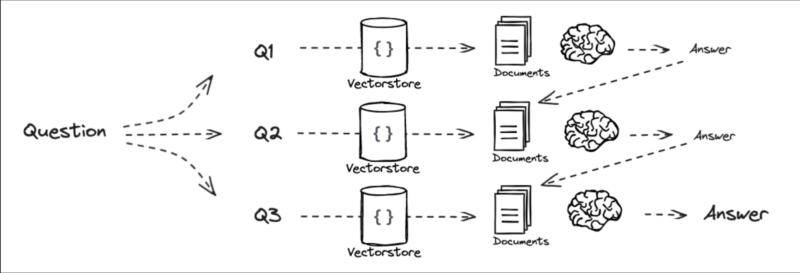
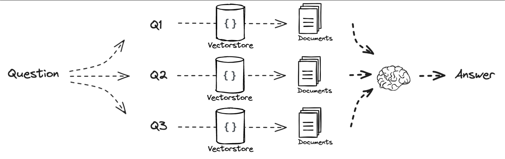

# What is decomposition?

Decompose a question into a set of subproblems / questions, which can either be solved sequentially (use the answer from first + retrieval to answer the second) or in parallel (consolidate each answer into final answer).

# When to use

When a question can be broken down into smaller subproblems.

# Example solution
This example is using sequential approach.

# Article

For the article from LangChain about decomposition click [here](https://github.com/langchain-a  i/rag-from-scratch/blob/main/rag_from_scratch_5_to_9.ipynb).

# Sequential Decomposition

Result of each previous sub-question is provided to next sub-question as context as prio question-answer pairs. And then the answer of the all sub-question is used as the context to answer the user's actual question in the first promopt.

# Parallel Decomposition

Result of each sub-question is collected independently. And then the answer of the all sub-question is used as the context to answer the user's actual question in the first promopt.

